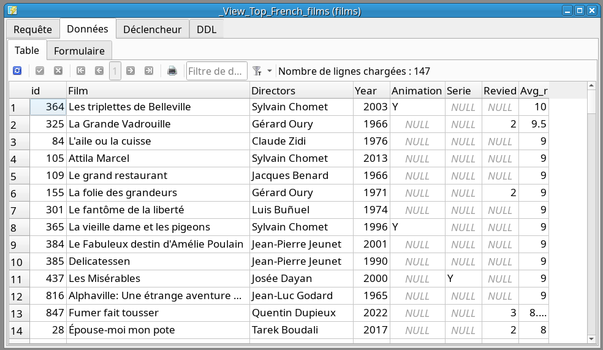
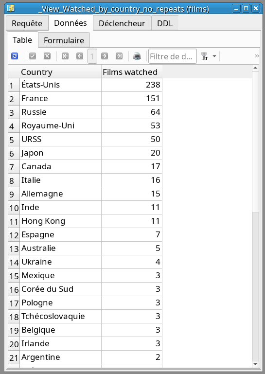
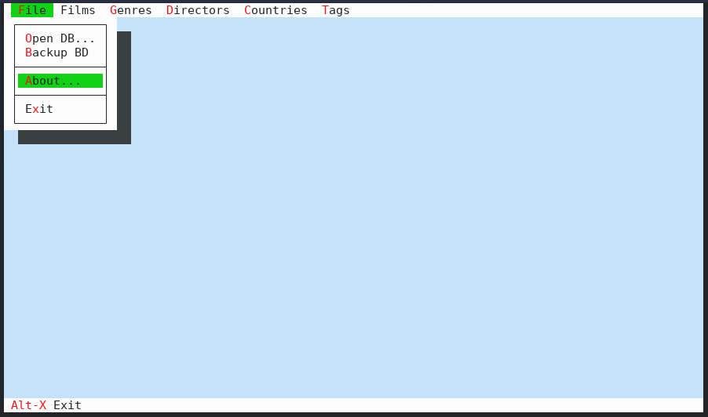

# Cinem, the small & simple film DB program

This SQLite database was created for personal use, because watching movies is a serious business (that's irony). I can see that, with the right mood, the number of French films will surpass the number of American ones.

The DDL script is located in the corresponding folder. The script also includes various views that make working with the database easier and more interesting (top movies, movies to watch, most rewatched films, etc.).

What does Turbo Vision have to do with it? Well, I just got tired of working in plain SQL Studio, and I also love text user interfaces, so I want my database to look like retro coding. 

Below, I’m sharing a couple of queries from the database in SQL Studio and the initial screen of the Turbo Vision environment.

[Modern port of Turbo Vision 2.0](https://github.com/magiblot/tvision)

## Queries in SQLiteStudio

### Top French Films:

### Number of Movies Watched by Country of Production

## Turbo Vision screen

